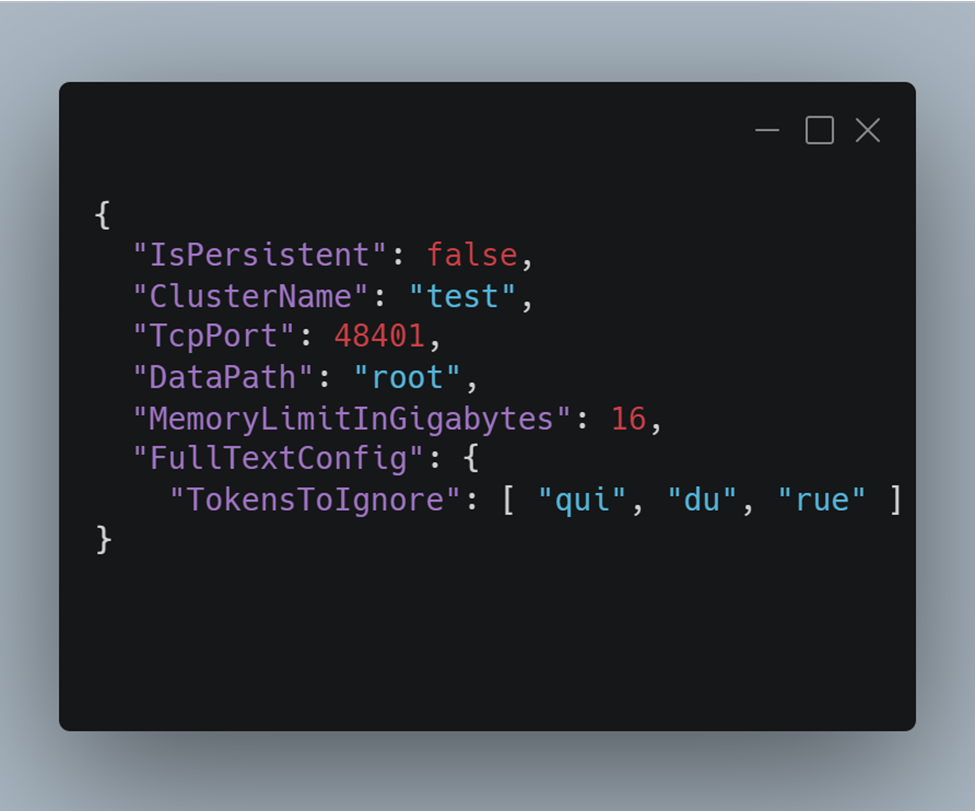

## The distribution package

Each release contains three zip files.

- **Platform dependent package**: it works on any compatible system if the dotnet runtime is installed.
- **Windows64 package**: It works on any recent windows 64bits system as a standalone application. Dotnet runtime is not required.
- **Linux64 package**: It works on Linux 64bits distributions as a standalone application. Before any release, it is extensively evaluated on the last LTS distribution on Ubuntu and Red Hat.

As it is an open-source project (MIT license), feel free to compile it for other platforms.

Inside each package there are three folders:

- **Server**: containing all the binaries required to install a server, the default configuration file, and a CSV import tool
- **Monitoring**: the new graphical monitoring tool

When deploying a Cachalot server (usually as a node in a multi-server cluster), copy the content of the “Server” folder from the distribution package to your installation folder.

{align=left}

On Windows, three applications are available: **Server.exe**, **WindowsService.exe** and **CSVImport.exe**. Server and WindowsService contain the same code packaged as a console application and a windows service. The console application can be started directly, the service must be installed using the provided **install.cmd** script. Administrative privileges are required to install the service. Once installed, it may be configured and started using the “Services” control panel.

 
{align=left}

On Linux, the application binaries are **Server** and **CSVImport**. The server can be either run directly or registered as a service with the “systemd.”

After decompressing the zip package on Linux, use chmod to add the execution rights on these two files.

 
 
 
 
 
 

## The configuration file

Running **Server.exe** without a command line parameter will read its configuration from the file **node_config.json**. When we specify a parameter, it will be interpreted as a suffix to the name of the configuration file.

For example, “**Server 01**” will use the config file **node_config_01.json**.

**Is Persistent:**

When true, it works in database mode, otherwise as a distributed cache.

**Cluster Name**:

Used for monitoring only, and it needs to be the same for all the cluster nodes.

**TCP port**:

The port. It needs to be unique on a machine.

**Data Path**:

If not present, the directory is automatically created when server starts. It contains two sub-directories: “data” and “logs.”

**Full Text Config**:

It is an optional list of tokens to ignore to speed up the full-text search. See the *QuickStart* for details.

**Memory Limit In Gigabytes:**

Mostly used for monitoring. All nodes in a cluster should have the same value.

## The files in the “data” directory

In cache mode (non-persistent), the data directory contains only the **schema.json** file which defines the schema for each collection. See the UserGuide for an explanation on the schema.

In persistent mode, “data” directory contains all the persistent data:

- The append-only transaction log

> All changes are **synchronously** appended to this file before being applied to the memory.
  
- The permanent storage

> All the events from the transaction log are **asynchronously** applied to this file by a background thread.

- The “sequence” file containing the last values for the unique key generators.

When the server starts on a non-empty database, it does some cleanup operations before accepting user connections:

- It applies all the pending transactions to the permanent storage.
- Then it compactifies the transaction log.
- Then it cleans up the datastore by removing deleted and dirty records.

> Dirty record = a record in the permanent storage that is not used anymore as the object it contained was updated, its size has grown, and it moved to the end of the file

**Simply restarting a server can release lots of disk space.**

## The monitoring application

This is a new component of the ecosystem available since the 2.5 version.

It consists of a self-contained web application. It includes a web server, the backend service, and the UI.

You can have a look without installing it at <https://cachalot-db.com/>. This is a showcase version that only allows the connection to predetermined list of clusters.

It can be run locally, deployed as-is or behind a reverse proxy (nginx for example).

The executable file is **CachalotMonitor.exe** on Windows and **CachalotMonitor** on Linux.

Comprehensive tooltips are available on each control, so we will not go into every detail here.

For security reasons, by default you connect as “guest.” No action that modifies data or schema is available. You can only examine the collections and their layout, schemas, and query data.

When installing it from the package, the “admin” password is not set. The first one you use will be accepted and will become the admin password that is checked for the new connections.

To reset the admin password, delete the file **user_hashes.txt** and restart the monitoring application.

### Brief description of the pages in the monitoring application

1. The “connection” tab:
    1. Allows to connect to a cluster by providing the explicit list of servers and ports.
    2. Or connect to a cluster you previously connected to, by a single click.
2. The “collections” tab:
    1. Visualize the collections. For each one you cans see:
        1. The layout
        2. The number of items in the collection
        3. The eviction type (applies only to non-persistent collections)
        4. If full-text search is available for the given collection
3. The “schema” tab:
    1. The list of query able properties on each collection and the type on index
    2. In admin mode indexes can be upgraded (from None to Dictionary or from Dictionary to Ordered)
4. The “data” tab:
    1. Query your data.
    2. Visualize your data as table (only query able properties) or as Json (full document).
    3. Examine the execution plan.
    4. Export or import data as Json.
    5. Delete specific data.
5. The “admin” tab: common administrative tasks as
    1. Backup/Restore/Recreate (more on these in the next chapter)
    2. Drop database.
    3. Switch on/off the read-only mode.
    4. Truncate or drop a collection.

## Backup / restore and migration procedure

Backup and restore are designed to be as fast as possible. To achieve this, every node in a cluster saves and restores data in parallel. The client only triggers the process.

> As we want all the node backups to be stored in the same place (normally on a different server than the cluster), the backup directory must be a shared network drive mapped under the same path for all the servers in the cluster.

**The cluster that produces the backup and the one that restores it must have the same number of nodes.**

To transfer data between two clusters with different configurations, another function is available: **Recreate**. 

In this case, the client reads the backup and feeds all data to the cluster. It is slower than “Restore”; data will be redistributed between the nodes of the target cluster.

**Recreate** does not remove data from the target database. It can be used to merge data from different clusters.

It you need to reinitialize an existing cluster drop the database before.

When restoring a backup, every node in the cluster performs a “soft restart.” The process is not terminated but all data (and schema information) is deleted and the server goes through the same initialization process as a normal start.

The cluster is not available during restore.

> While running a backup the cluster is still available for read-only operations. All write actions will be queued and executed after.
 
> If the database is updated frequently, switching it to read-only mode before starting the backup is a guarantee to produce a consistent backup for the whole cluster.